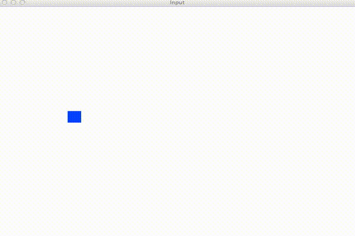
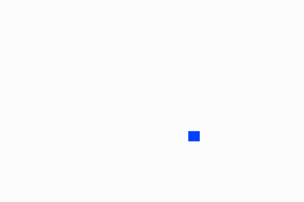

# Graphics

## 1. Bouncing Square

Write a program which will display a square which should bounce around the screen.

To do this, you must use the `Move` and `GetPosition` functions.

You can call `rect.Move(sf.Vector2f{x, y})` which will move the rectangle
`x` pixels to the right and `y` pixels down.

You can call `rect.GetPosition()` which will return a struct with type `sf.Vector2f`.
This struct will contain the x and y coordinates of the rectangle. The coordinates
will be pixel positions, so `sf.Vector2f{200, 300}` means the square is 200 pixels
to the right and 300 pixels down (from the top right corner of the window).

For example:

```go
rect.Move(sf.Vector2f{5, 5}) // Move the rect 5 pixels right and 5 pixels down
v := rect.GetPosition() // Get the position
fmt.Println(v.X) // Access the X component of the vector
fmt.Println(v.Y) // Access the Y component of the vector
```

The idea of the program is that you have to move the square by some amount every
frame (it doesn't matter what velocity you start with) and every frame check
if the square has gone off the screen. If it has, reverse the x or y direction
(depending on if the square hit the left/right walls vs the top/bottom walls).

Hint: You should store the x and y velocity in variables and then you can move the square
by that amount in the x and y directions every frame. Then to reverse the x direction
(when you hit the left or right side of the screen) you just say `vx = -vx` (i.e. the
x velocity becomes negative the x velocity).

Hint: To check if you hit the left or right side of the screen check if the x position
of the square is less than 0 or greater than the width of the screen.



NOTE: On a retina display computer the window might look a bit small (because the pixels are smaller). 
Feel free to change the size of the window and/or the size of the square.

## 2. Bonus: gravity.go

Try to simulate gravity with the bouncing square. This time don't worry about
the square hitting the top of window.



Hint: when the rect bounces off the bottom of the screen you have to set
its position to the `screenHeight` because otherwise the acceleration from
gravity might be able to pull it beneath the window and out of the view (which 
isn't supposed to happen).

Hint: Remember that gravity is just a number (1 seems like a good choice here)
and since gravity is acceleration, the y velocity of the rect changes by that
amount every frame.
